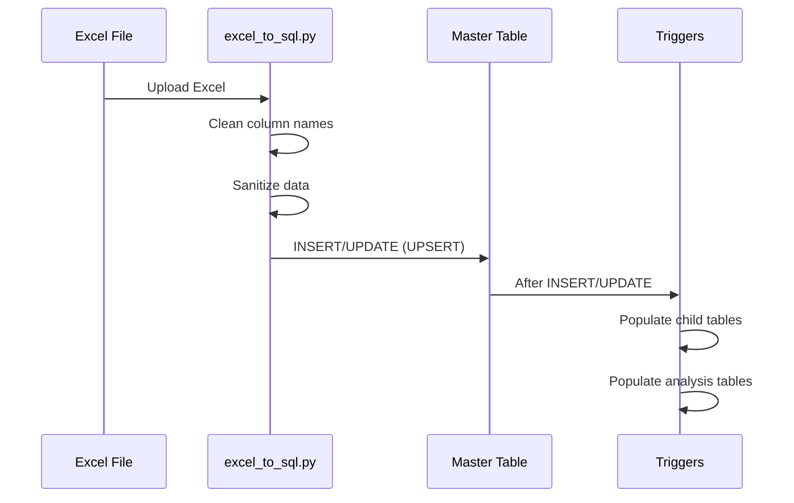
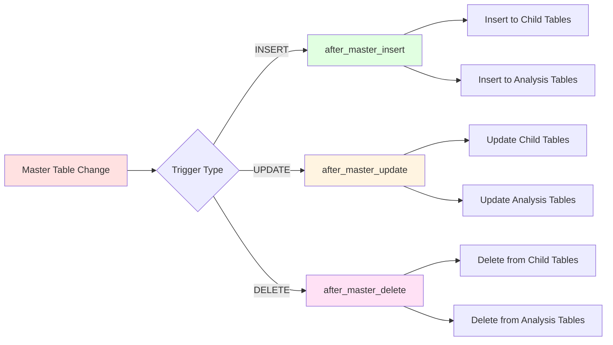
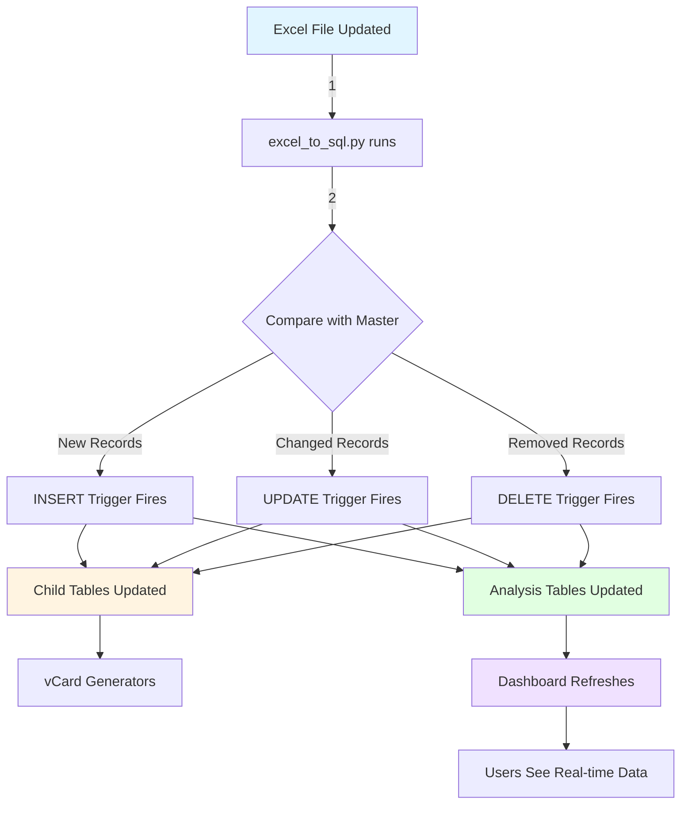
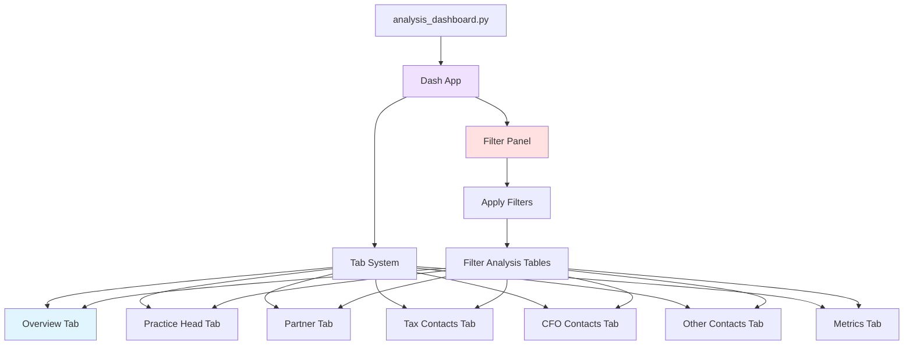
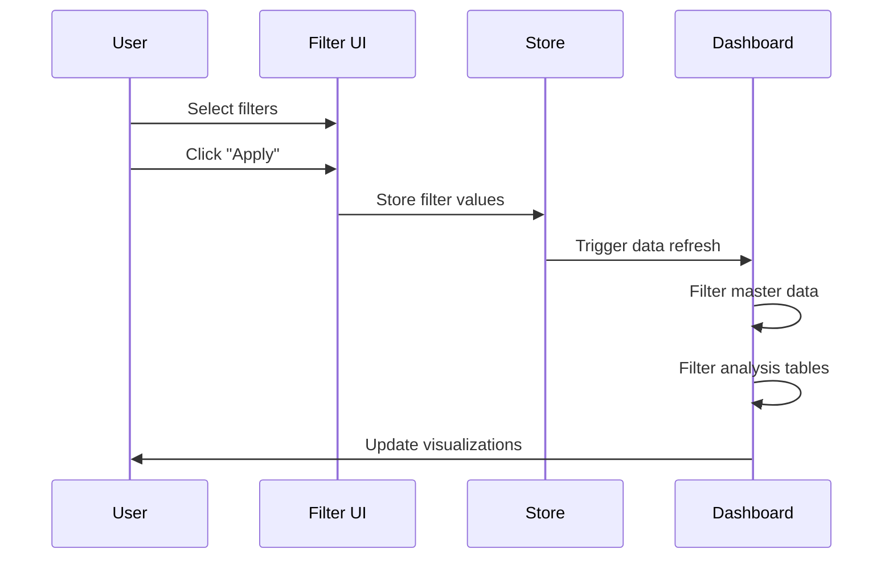
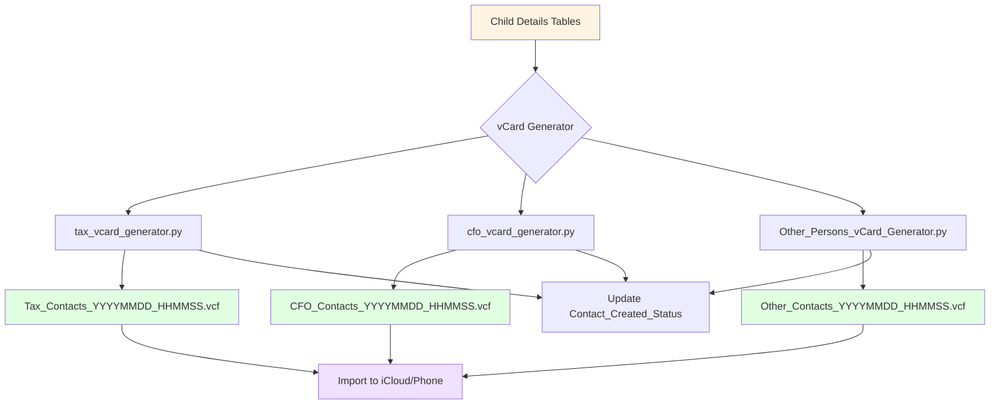
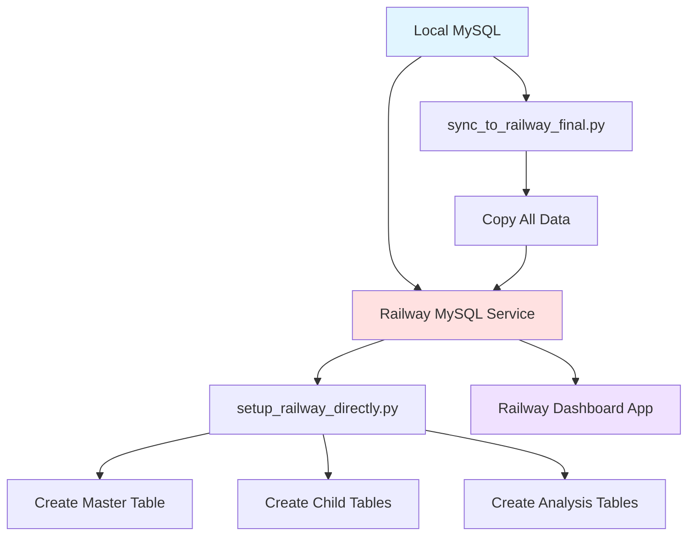
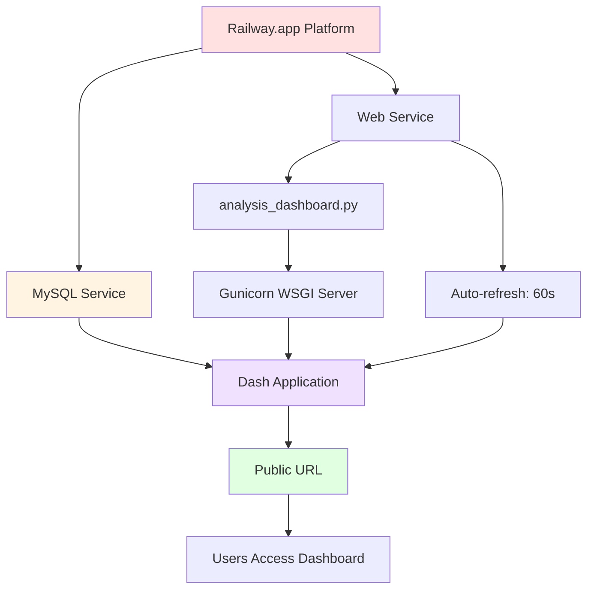
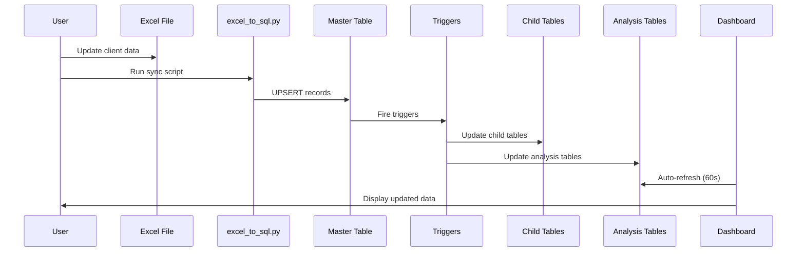

```mermaid
graph TB
    A[Excel Master File] -->|excel_to_sql.py| B[Master Table]
    B -->|setup_database_architecture.py| C[Child Tables]
    B -->|analysis_table_with_auto_triggers.py| D[Analysis Tables]
    C -->|Triggers| E[Auto-Sync System]
    D -->|Triggers| E
    E -->|Real-time Updates| F[Dashboard]
    C -->|vcard_generators| G[Contact Files .vcf]
    D -->|Filtered Data| F
    F -->|Web Interface| H[Users]
    
    style A fill:#02283B
    style B fill:#ffe1e1
    style C fill:#fff4e1
    style D fill:#e1ffe1
    style F fill:#f0e1ff
    style G fill:#ffe1f5
```

# Tax Summit Analytics Dashboard - Complete Documentation

## 📊 Overview

The Tax Summit Analytics Dashboard is a comprehensive data management and visualization system built with Python, MySQL, and Dash (Plotly). It manages client invitations, contact information, and event registrations for tax summit events, providing real-time analytics and automated contact management.

---

## 📑 Table of Contents

### 1. Introduction
- [📊 Overview](#-overview)
- [🏗️ System Architecture](#️-system-architecture)

### 2. Database Design
- [🗄️ Database Schema](#️-database-schema)
  - [1️⃣ Master Table: `tax_summit_master_data`](#1️⃣-master-table-tax_summit_master_data)
  - [2️⃣ Child Tables (Contact Details)](#2️⃣-child-tables-contact-details)
    - [📞 Tax_Persons_details](#-tax_persons_details)
    - [💼 CFO_Persons_details](#-cfo_persons_details)
    - [👥 Other_Persons_Details](#-other_persons_details)
  - [3️⃣ Analysis Tables (Dashboard Data)](#3️⃣-analysis-tables-dashboard-data)
    - [📊 Tax_Persons_Analysis](#-tax_persons_analysis)
    - [💰 CFO_Persons_Analysis](#-cfo_persons_analysis)
    - [👔 Other_Persons_Analysis](#-other_persons_analysis)

### 3. Automation & Triggers
- [⚙️ Trigger System (Auto-Sync)](#️-trigger-system-auto-sync)
  - [Trigger Architecture](#trigger-architecture)
  - [1️⃣ INSERT Trigger](#1️⃣-insert-trigger)
  - [2️⃣ UPDATE Trigger](#2️⃣-update-trigger)
  - [3️⃣ DELETE Trigger](#3️⃣-delete-trigger)
- [🔄 Data Synchronization Flow](#-data-synchronization-flow)
  - [Complete Data Pipeline](#complete-data-pipeline)
  - [Sync Mode Comparison](#sync-mode-comparison)

### 4. Dashboard & Analytics
- [📈 Dashboard Analytics](#-dashboard-analytics)
  - [Dashboard Architecture](#dashboard-architecture)
  - [Key Dashboard Features](#key-dashboard-features)
  - [🎛️ Filter System](#️-filter-system)
  - [📊 Overview Tab](#-overview-tab)
  - [👔 Practice Head Tab](#-practice-head-tab)
  - [🤝 Partner Tab](#-partner-tab)
  - [💼 Tax Contacts Tab](#-tax-contacts-tab)
  - [💰 CFO Contacts Tab](#-cfo-contacts-tab)
  - [👥 Other Contacts Tab](#-other-contacts-tab)
  - [📈 Metrics Tab](#-metrics-tab)

### 5. Contact Management
- [📱 vCard Generation System](#-vcard-generation-system)
  - [vCard Architecture](#vcard-architecture)
  - [vCard Generation Process](#vcard-generation-process)
    - [1️⃣ Selection Criteria](#1️⃣-selection-criteria)
    - [2️⃣ vCard Format (vCard 3.0)](#2️⃣-vcard-format-vcard-30)
    - [3️⃣ Special Character Handling](#3️⃣-special-character-handling)
    - [4️⃣ Status Tracking](#4️⃣-status-tracking)
  - [vCard Generator Scripts](#vcard-generator-scripts)

### 6. Database Maintenance
- [🔧 Database Maintenance Scripts](#-database-maintenance-scripts)
  - [1️⃣ debug_analysis.py](#1️⃣-debug_analysispy)
  - [2️⃣ fix_duplicates_phone.py](#2️⃣-fix_duplicates_phonepy)
  - [3️⃣ python_fix_analysis_table_sync.py](#3️⃣-python_fix_analysis_table_syncpy)
  - [4️⃣ enhanced_analysis_table_triggers.py](#4️⃣-enhanced_analysis_table_triggerspy)

### 7. Deployment
- [🚂 Railway Deployment](#-railway-deployment)
  - [Railway Database Setup](#railway-database-setup)
  - [Railway Scripts](#railway-scripts)
    - [1️⃣ setup_railway_directly.py](#1️⃣-setup_railway_directlypy)
    - [2️⃣ sync_to_railway_final.py](#2️⃣-sync_to_railway_finalpy)
    - [3️⃣ test_railway.py](#3️⃣-test_railwaypy)
    - [4️⃣ drop_all_railways_table.py](#4️⃣-drop_all_railways_tablepy)
    - [5️⃣ fix_railway_analysis_tables.py](#5️⃣-fix_railway_analysis_tablespy)
- [🌐 Dashboard Deployment](#-dashboard-deployment)
  - [Deployment Architecture](#deployment-architecture)
  - [Deployment Configuration](#deployment-configuration)
  - [Dashboard Features](#dashboard-features)

### 8. Data Processing
- [📊 Data Normalization](#-data-normalization)
  - [Response Label Normalization](#response-label-normalization)
  - [Name Standardization](#name-standardization)
- [🗺️ Region Mapping](#️-region-mapping)
  - [Location to Region Algorithm](#location-to-region-algorithm)
  - [Region Distribution](#region-distribution)

### 9. Security & Best Practices
- [🔐 Security & Best Practices](#-security--best-practices)
  - [Environment Variables](#environment-variables)
  - [.gitignore Configuration](#gitignore-configuration)
  - [Database Security](#database-security)

### 10. Workflows & Examples
- [📚 Complete Workflow Example](#-complete-workflow-example)
  - [From Excel to Dashboard](#from-excel-to-dashboard)
  - [Step-by-Step Process](#step-by-step-process)

### 11. Troubleshooting
- [🛠️ Troubleshooting Guide](#️-troubleshooting-guide)
  - [Common Issues](#common-issues)
    - [Issue 1: Sync Discrepancies](#issue-1-sync-discrepancies)
    - [Issue 2: Duplicate Phone Numbers](#issue-2-duplicate-phone-numbers)
    - [Issue 3: Railway Deployment Issues](#issue-3-railway-deployment-issues)
    - [Issue 4: Triggers Not Firing](#issue-4-triggers-not-firing)

### 12. API & Reference
- [📖 API Reference](#-api-reference)
  - [Database Functions](#database-functions)
  - [Dashboard Functions](#dashboard-functions)
- [📊 Database Statistics](#-database-statistics)
  - [Typical Data Volumes](#typical-data-volumes)
  - [Index Performance](#index-performance)

### 13. Future & Maintenance
- [🚀 Future Enhancements](#-future-enhancements)
  - [Potential Features](#potential-features)
- [📞 Support & Maintenance](#-support--maintenance)
  - [Regular Maintenance Tasks](#regular-maintenance-tasks)
  - [Backup Strategy](#backup-strategy)

### 14. Appendix
- [📝 Conclusion](#-conclusion)
- [📚 Appendix](#-appendix)
  - [Technology Stack](#technology-stack)
  - [File Structure](#file-structure)
  - [Quick Reference Commands](#quick-reference-commands)

---

## 📊 Overview

The Tax Summit Analytics Dashboard is a comprehensive data management and visualization system built with Python, MySQL, and Dash (Plotly). It manages client invitations, contact information, and event registrations for tax summit events, providing real-time analytics and automated contact management.

---

*(Continue with the rest of the documentation as provided above...)*

---

**Navigation Tips**:
- Click on any section link to jump directly to that content
- Use your browser's back button to return to the table of contents
- Use `Ctrl+F` (Windows) or `Cmd+F` (Mac) to search for specific topics

**Document Structure**:
```
📑 Table of Contents
  ├─ 📊 Introduction & Architecture (Sections 1)
  ├─ 🗄️ Database Design (Section 2)
  ├─ ⚙️ Automation Systems (Section 3)
  ├─ 📈 Analytics & Visualization (Section 4)
  ├─ 📱 Contact Management (Section 5)
  ├─ 🔧 Maintenance Tools (Section 6)
  ├─ 🚂 Deployment Guides (Section 7)
  ├─ 📊 Data Processing (Section 8)
  ├─ 🔐 Security (Section 9)
  ├─ 📚 Workflows (Section 10)
  ├─ 🛠️ Troubleshooting (Section 11)
  ├─ 📖 API Reference (Section 12)
  ├─ 🚀 Future Plans (Section 13)
  └─ 📚 Appendix (Section 14)
```

## 🏗️ System Architecture



---

## 🗄️ Database Schema

### 1️⃣ Master Table: `tax_summit_master_data`

**Purpose**: Central repository for all client and invitation data.

**Key Features**:
- ✅ Single source of truth for all data
- ✅ Unique constraint on `Client_Name`
- ✅ Supports multiple contact types per client
- ✅ Auto-timestamps for tracking changes

**Structure**:

```sql
tax_summit_master_data
├── id (PRIMARY KEY, AUTO_INCREMENT)
├── Client_Name (VARCHAR(255), UNIQUE)
├── Practice_Head (VARCHAR/TEXT)
├── Partner (VARCHAR/TEXT)
├── Sector (VARCHAR/TEXT)
├── Location (VARCHAR/TEXT)
├── Invite_Status (TEXT)
├── Invite_Dt (TEXT)
├── Circle_Back_Dt (TEXT)
├── numInvitees (TEXT)
├── numRegistrations (TEXT)
├── Response (TEXT)
│
├── Tax Contact Information
│   ├── Tax_Contact (TEXT)
│   ├── Designation (TEXT)
│   ├── Email_ID (TEXT)
│   ├── Phone_Number (TEXT)
│   └── Response_1 (TEXT)
│
├── CFO Contact Information
│   ├── CFO_Name (TEXT)
│   ├── Designation_2 (TEXT)
│   ├── Email_ID_3 (TEXT)
│   ├── Phone_Number_4 (TEXT)
│   ├── Location_6 (TEXT)
│   └── Response_7 (TEXT)
│
├── Other Contact Information
│   ├── Others (TEXT)
│   ├── Designation_8 (TEXT)
│   ├── Email_ID_9 (TEXT)
│   ├── Phone_Number_10 (TEXT)
│   ├── Location_12 (TEXT)
│   └── Response_13 (TEXT)
│
├── Data_Insert_Time (TIMESTAMP, DEFAULT CURRENT_TIMESTAMP)
└── Last_Updated (TIMESTAMP, DEFAULT CURRENT_TIMESTAMP ON UPDATE)
```

**Data Flow**:



---

### 2️⃣ Child Tables (Contact Details)

These tables store individual contact information separated by designation type.

#### 📞 Tax_Persons_details

**Purpose**: Stores tax contact information for vCard generation.

**Structure**:

```sql
Tax_Persons_details
├── S_No (PRIMARY KEY, AUTO_INCREMENT)
├── Client_Name (VARCHAR(255), FOREIGN KEY → Master)
├── numRegistrations (VARCHAR(255))
├── Tax_Contact (VARCHAR(255))
├── Designation (VARCHAR(255))
├── Email_ID (VARCHAR(255))
├── Phone_Number (VARCHAR(255), UNIQUE)
├── Response_1 (VARCHAR(255))
├── Data_Insert_Time (TIMESTAMP)
├── Contact_File_Created_Time_Stamp (TIMESTAMP NULL)
└── Contact_Created_Status (TINYINT(1), DEFAULT 0)
```

**Indexes**:
- `idx_client` on `Client_Name`
- `idx_contact_status` on `Contact_Created_Status`
- `idx_created_time` on `Contact_File_Created_Time_Stamp`

#### 💼 CFO_Persons_details

**Purpose**: Stores CFO contact information.

**Structure**:

```sql
CFO_Persons_details
├── S_No (PRIMARY KEY, AUTO_INCREMENT)
├── Company_Name (VARCHAR(255), FOREIGN KEY → Master.Client_Name)
├── numRegistrations (VARCHAR(255))
├── CFO_Name (VARCHAR(255))
├── Designation_2 (VARCHAR(255))
├── Email_ID_3 (VARCHAR(255))
├── Phone_Number_4 (VARCHAR(255), UNIQUE)
├── Response_7 (VARCHAR(255))
├── Data_Insert_Time (TIMESTAMP)
├── Contact_File_Created_Time_Stamp (TIMESTAMP NULL)
└── Contact_Created_Status (TINYINT(1), DEFAULT 0)
```

#### 👥 Other_Persons_Details

**Purpose**: Stores other contact information.

**Structure**:

```sql
Other_Persons_Details
├── S_No (PRIMARY KEY, AUTO_INCREMENT)
├── Company_Name (VARCHAR(255), FOREIGN KEY → Master.Client_Name)
├── numRegistrations (VARCHAR(255))
├── Others (VARCHAR(255))
├── Designation_8 (VARCHAR(255))
├── Email_ID_9 (VARCHAR(255))
├── Phone_Number_10 (VARCHAR(255), UNIQUE)
├── Response_13 (VARCHAR(255))
├── Data_Insert_Time (TIMESTAMP)
├── Contact_File_Created_Time_Stamp (TIMESTAMP NULL)
└── Contact_Created_Status (TINYINT(1), DEFAULT 0)
```

**Contact Status Tracking**:

| Status | Meaning |
|--------|---------|
| `0` | Contact file **not yet created** |
| `1` | Contact file **created** and timestamped |

---

### 3️⃣ Analysis Tables (Dashboard Data)

These tables power the analytics dashboard with filtered, optimized data.

#### 📊 Tax_Persons_Analysis

**Purpose**: Provides comprehensive analytics for tax contacts.

**Structure**:

```sql
Tax_Persons_Analysis
├── S_No (PRIMARY KEY, AUTO_INCREMENT)
├── Client_Name (VARCHAR(255), FOREIGN KEY → Master)
├── Practice_Head (VARCHAR(255))
├── Partner (VARCHAR(255))
├── Invite_Status (VARCHAR(255))
├── numInvitees (VARCHAR(255))
├── Response (VARCHAR(255))
├── Sector (VARCHAR(255))
├── numRegistrations (VARCHAR(255))
├── Tax_Contact (VARCHAR(255))
├── Designation (VARCHAR(255))
├── Email_ID (VARCHAR(255))
├── Phone_Number (VARCHAR(255), UNIQUE)
├── Location (VARCHAR(255))
├── Response_1 (VARCHAR(255))
├── Data_Insert_Time (TIMESTAMP)
└── Last_Updated (TIMESTAMP)
```

**Indexes for Fast Queries**:
- `idx_client` on `Client_Name`
- `idx_practice_head` on `Practice_Head`
- `idx_partner` on `Partner`
- `idx_invite_status` on `Invite_Status`
- `idx_sector` on `Sector`
- `idx_response` on `Response`

#### 💰 CFO_Persons_Analysis

**Purpose**: Analytics for CFO contacts.

**Structure**: Similar to Tax_Persons_Analysis with CFO-specific fields.

```sql
CFO_Persons_Analysis
├── S_No (PRIMARY KEY)
├── Company_Name (FK → Master.Client_Name)
├── Practice_Head, Partner, Invite_Status
├── numInvitees, Response, Sector, numRegistrations
├── CFO_Name, Designation_2, Email_ID_3
├── Phone_Number_4 (UNIQUE)
├── Location_6, Response_7
└── Timestamps
```

#### 👔 Other_Persons_Analysis

**Purpose**: Analytics for other contacts.

**Structure**: Similar pattern with other-specific fields.

```sql
Other_Persons_Analysis
├── S_No (PRIMARY KEY)
├── Company_Name (FK → Master.Client_Name)
├── Practice_Head, Partner, Invite_Status
├── numInvitees, Response, Sector, numRegistrations
├── Others, Designation_8, Email_ID_9
├── Phone_Number_10 (UNIQUE)
├── Location_12, Response_13
└── Timestamps
```

---

## ⚙️ Trigger System (Auto-Sync)

The system uses MySQL triggers to maintain data consistency across all tables automatically.

### Trigger Architecture



### 1️⃣ INSERT Trigger

**Trigger Name**: `after_master_insert_analysis`

**Purpose**: When a new row is added to master table, automatically populate child and analysis tables.

**Logic**:

```sql
-- Pseudo-code representation
FOR EACH new row in master_table:
    IF Phone_Number is not null:
        INSERT INTO Tax_Persons_details
        INSERT INTO Tax_Persons_Analysis (with ON DUPLICATE KEY UPDATE)
    
    IF Phone_Number_4 is not null:
        INSERT INTO CFO_Persons_details
        INSERT INTO CFO_Persons_Analysis (with ON DUPLICATE KEY UPDATE)
    
    IF Phone_Number_10 is not null:
        INSERT INTO Other_Persons_Details
        INSERT INTO Other_Persons_Analysis (with ON DUPLICATE KEY UPDATE)
```

**Key Features**:
- ✅ Uses `INSERT IGNORE` for child tables (skip duplicates)
- ✅ Uses `ON DUPLICATE KEY UPDATE` for analysis tables (upsert logic)
- ✅ Only processes contacts with valid phone numbers
- ✅ Automatically sets `Data_Insert_Time`

### 2️⃣ UPDATE Trigger

**Trigger Name**: `after_master_update_analysis`

**Purpose**: When master table is updated, sync changes to child and analysis tables.

**Logic**:

```sql
-- Comprehensive update logic
FOR EACH updated row:
    IF phone number changed:
        DELETE old record
        INSERT new record
    ELSE:
        UPDATE all fields in place
    
    IF phone number became null:
        DELETE from child/analysis tables
```

**Updated Fields**:
- Practice_Head, Partner, Sector, Location
- Response, Response_1, Response_7, Response_13
- numInvitees, numRegistrations
- Contact names, designations, emails
- Automatically updates `Last_Updated` timestamp

### 3️⃣ DELETE Trigger

**Trigger Name**: `after_master_delete_analysis`

**Purpose**: Cascade delete to child and analysis tables when master record is deleted.

**Logic**:

```sql
FOR EACH deleted row:
    DELETE from Tax_Persons_details WHERE Phone_Number matches
    DELETE from Tax_Persons_Analysis WHERE Phone_Number matches
    DELETE from CFO_Persons_details WHERE Phone_Number_4 matches
    DELETE from CFO_Persons_Analysis WHERE Phone_Number_4 matches
    DELETE from Other_Persons_Details WHERE Phone_Number_10 matches
    DELETE from Other_Persons_Analysis WHERE Phone_Number_10 matches
```

---

## 🔄 Data Synchronization Flow

### Complete Data Pipeline



### Sync Mode Comparison

| Mode | Insert New | Update Existing | Delete Removed |
|------|------------|-----------------|----------------|
| **insert** | ✅ | ❌ | ❌ |
| **upsert** | ✅ | ✅ | ❌ |
| **smart_sync** | ✅ | ✅ | ✅ |

**Recommended**: Use `smart_sync` mode for complete synchronization.

---

## 📈 Dashboard Analytics

### Dashboard Architecture



### Key Dashboard Features

#### 🎛️ Filter System

**Available Filters**:
- **Practice Head**: Filter by practice head name
- **Partner**: Filter by partner name
- **Sector**: Filter by business sector
- **Location**: Filter by geographic location
- **Response Status**: Filter by response type

**Filter Behavior**:


**Implementation**:
- Filters stored in `dcc.Store` component
- Applied on "Apply Filters" button click
- Analysis tables filtered based on master table filters
- Reset button clears all filters
- Auto-refresh every 60 seconds

#### 📊 Overview Tab

**Metrics Displayed**:

```
┌─────────────────────────────────────────────────────────────┐
│  Total Clients     Total Invitees     Registrations    Response Rate │
│     [  XXX  ]         [ X,XXX ]         [  XXX  ]        [ XX.X% ]   │
└─────────────────────────────────────────────────────────────┘
```

**Visualizations**:

1. **Response Distribution** (Pie Chart)
   - Shows weighted response counts
   - Supports numeric prefixes (e.g., "2 Positive" = 2 counts)
   - Color-coded by response type

2. **Sector Performance** (Bar Chart)
   - X-axis: Sector names
   - Y-axis: Conversion rate (%)
   - Color intensity: Performance indicator

3. **Region-wise Distribution** (Bar Chart)
   - Automatically maps locations to regions:
     - **North**: Delhi, Gurugram, Noida, Faridabad
     - **South**: Bangalore, Chennai, Hyderabad, Kochi
     - **East**: Kolkata, Jamshedpur, Odisha
     - **West**: Mumbai, Pune, Ahmedabad, Surat
     - **Other**: International/unmapped locations

#### 👔 Practice Head Tab

**Key Metrics**:
- Total clients per practice head
- Total invitees per practice head
- Total responses received
- Total registrations confirmed

**Charts**:

1. **Invites & Registrations** (Grouped Bar Chart)
   ```
   Practice Head 1  ████████ Invites
                    ████ Registrations
   Practice Head 2  ██████████ Invites
                    ██████ Registrations
   ```

2. **Response Split** (Stacked Bar Chart)
   - Shows response distribution by practice head
   - Weighted responses normalized

3. **Sector Distribution** (Sunburst Chart)
   - Hierarchical view: Practice Head → Sector
   - Interactive drill-down

4. **Location Split** (Stacked Bar Chart)
   - Shows geographic distribution

5. **Designation-wise Analysis** (3 Grouped Bar Charts)
   - Tax profiles response split
   - CFO profiles response split
   - Other profiles response split

#### 🤝 Partner Tab

**Similar structure to Practice Head Tab**:
- Performance metrics by partner
- Response analysis
- Location distribution
- Designation-wise breakdowns

#### 💼 Tax Contacts Tab

**Key Metrics**:
- Total invited tax contacts
- Total registered (Response_1 = 'Registered')
- Response rate percentage

**Visualizations**:

1. **Response Status Distribution** (Pie Chart)
   - Normalized response labels
   - Weighted counts

2. **Region-wise Confirmations** (Bar Chart)
   ```
   North  ████████████ Total Confirmed
   South  ██████████ Total Confirmed
   East   ████ Total Confirmed
   West   ██████████████ Total Confirmed
   ```

3. **Region-wise Confirmations** (Line Chart)
   - Same data in line format
   - Shows trends across regions

**Calculation Logic**:
```python
Total Confirmed = Registered + Positive Responses
Registration Rate = (Total Confirmed / Total Invited) × 100%
```

#### 💰 CFO Contacts Tab

**Similar structure to Tax Contacts Tab**:
- Response distribution for CFO contacts
- Region-wise confirmations
- Both bar and line chart views

#### 👥 Other Contacts Tab

**Similar structure to Tax/CFO tabs**:
- Response analysis for other designations
- Regional breakdowns
- Confirmation tracking

#### 📈 Metrics Tab

**Advanced Analytics**:

1. **Key Performance Indicators**:
   ```
   Conversion Rate     Response Rate    Pending Follow-ups    Circle Backs
   [   XX.X%   ]      [   XX.X%   ]    [    XXX    ]        [   XX   ]
   ```

2. **Invite Trend Over Time** (Line Chart)
   - Daily invite distribution
   - Time-series analysis

3. **Conversion Funnel** (Funnel Chart)
   ```
   Total Clients      ████████████████████ 100%
   Total Invitees     ██████████████████ 85%
   Responses          ████████████ 60%
   Registrations      ████████ 40%
   ```

4. **Response Status Breakdown** (Bar Chart)
   - Detailed response analysis
   - Color-coded by status

---

## 📱 vCard Generation System

### vCard Architecture



### vCard Generation Process

#### 1️⃣ Selection Criteria

**Contacts are selected if**:
```sql
WHERE Contact_Created_Status = 0  -- Not yet created
AND Phone_Number IS NOT NULL      -- Has valid phone
AND Phone_Number != ''            -- Phone not empty
AND numRegistrations = 1          -- Registered for event
AND Response >= 0                 -- Positive or neutral response
AND Response IS NOT NULL          -- Response exists
```

#### 2️⃣ vCard Format (vCard 3.0)

**Structure**:
```
BEGIN:VCARD
VERSION:3.0
FN:John Doe (CFO) Company Ltd
N:Company Ltd;John Doe (CFO);;;
TEL;TYPE=WORK,VOICE:+91-9876543210
EMAIL;TYPE=WORK:john.doe@company.com
END:VCARD
```

**Name Format**:
- **First Name**: `Contact Name (Designation)`
  - Example: `John Doe (CFO)`
- **Last Name**: `Company Name`
  - Example: `Company Ltd`
- **Full Name (FN)**: `First Name Last Name`
  - Example: `John Doe (CFO) Company Ltd`

#### 3️⃣ Special Character Handling

**Sanitization Rules**:
```python
\ → \\    (Escape backslash)
, → \,    (Escape comma)
; → \;    (Escape semicolon)
\n → \\n  (Escape newline)
```

#### 4️⃣ Status Tracking

**After vCard generation**:
```sql
UPDATE Contact_Details_Table
SET Contact_Created_Status = 1,
    Contact_File_Created_Time_Stamp = CURRENT_TIMESTAMP
WHERE S_No IN (generated_contacts)
```

**Benefits**:
- ✅ Prevents duplicate vCard generation
- ✅ Tracks when contacts were exported
- ✅ Audit trail for contact management

### vCard Generator Scripts

| Script | Source Table | Output Format | Key Fields |
|--------|--------------|---------------|------------|
| `tax_vcard_generator.py` | Tax_Persons_details | Tax_Contacts_*.vcf | Tax_Contact, Designation, Phone_Number |
| `cfo_vcard_generator.py` | CFO_Persons_details | CFO_Contacts_*.vcf | CFO_Name, Designation_2, Phone_Number_4 |
| `Other_Persons_vCard_Generator.py` | Other_Persons_Details | Other_Contacts_*.vcf | Others, Designation_8, Phone_Number_10 |

---

## 🔧 Database Maintenance Scripts

### 1️⃣ debug_analysis.py

**Purpose**: Diagnose sync issues between master and analysis tables.

**Features**:
- ✅ Checks table existence (case-sensitive)
- ✅ Verifies table structures
- ✅ Counts records in each table
- ✅ Identifies missing records
- ✅ Tests manual INSERT queries
- ✅ Provides detailed error diagnostics

**Output Example**:
```
[1] Checking if tables exist...
    ✓ tax_summit_master_data exists
    ✓ Tax_Persons_Analysis exists

[2] Checking tax_summit_master_data structure...
    Found 28 columns:
      ✓ Client_Name
      ✓ Practice_Head
      ✗ Some_Missing_Column MISSING

[3] Checking Tax_Persons_Analysis structure...
    Found 16 columns

[4] Checking data in tax_summit_master_data...
    Total rows: 100
    Rows with valid Phone_Number: 85

[5] Testing manual INSERT...
    ✓ Test insert successful!
```

### 2️⃣ fix_duplicates_phone.py

**Purpose**: Handle duplicate phone numbers across different clients.

**Problem**:
- Multiple clients may share the same phone number
- UNIQUE constraint on phone number prevents storing all contacts
- Dashboard shows fewer contacts than exist

**Solution**:

1. **Remove single-column UNIQUE constraint**
   ```sql
   ALTER TABLE Tax_Persons_Analysis DROP INDEX Phone_Number;
   ```

2. **Add composite UNIQUE constraint**
   ```sql
   ALTER TABLE Tax_Persons_Analysis 
   ADD UNIQUE INDEX idx_phone_client (Phone_Number, Client_Name);
   ```

**Benefits**:
- ✅ Allows same phone for different clients
- ✅ Prevents true duplicates (same phone + same client)
- ✅ All contacts visible in dashboard

### 3️⃣ python_fix_analysis_table_sync.py

**Purpose**: Comprehensive sync fix with full resync capability.

**Process**:

1. **Check Current Sync Status**
   ```
   Master → Analysis (Current State):
     Tax:   182 → 176   (6 missing)
     CFO:   45 → 45     (0 missing)
     Other: 23 → 20     (3 missing)
   ```

2. **Drop Old Triggers**
   ```sql
   DROP TRIGGER IF EXISTS after_master_insert_analysis;
   DROP TRIGGER IF EXISTS after_master_update_analysis;
   DROP TRIGGER IF EXISTS after_master_delete_analysis;
   ```

3. **Full Resync**
   ```sql
   DELETE FROM Tax_Persons_Analysis;
   INSERT INTO Tax_Persons_Analysis SELECT ... FROM master;
   -- Repeat for CFO and Other
   ```

4. **Create Enhanced Triggers**
   - New INSERT trigger with ON DUPLICATE KEY UPDATE
   - Comprehensive UPDATE trigger handling all fields
   - DELETE trigger with cascade logic

5. **Verify Sync**
   ```
   Master → Analysis (After Fix):
     Tax:   182 → 182   (0 missing) ✅
     CFO:   45 → 45     (0 missing) ✅
     Other: 23 → 23     (0 missing) ✅
   ```

### 4️⃣ enhanced_analysis_table_triggers.py

**Purpose**: Update triggers with comprehensive field updates.

**Enhanced Features**:

1. **Handles Phone Number Changes**
   ```sql
   IF old_phone != new_phone THEN
       DELETE old record
       INSERT new record
   ELSE
       UPDATE all fields
   END IF
   ```

2. **Handles NULL Phone Numbers**
   ```sql
   IF phone becomes NULL THEN
       DELETE from analysis table
   END IF
   ```

3. **Updates ALL Fields**
   - Practice_Head, Partner
   - Invite_Status, Response
   - Sector, Location
   - Contact names, designations
   - Email addresses
   - Registration counts

4. **Test Functionality**
   ```python
   # Update a sample record
   UPDATE master SET Practice_Head = 'TEST_VALUE'
   
   # Verify analysis table updated
   SELECT Practice_Head FROM Analysis WHERE ...
   # Should show 'TEST_VALUE'
   ```

---

## 🚂 Railway Deployment

### Railway Database Setup



### Railway Scripts

#### 1️⃣ setup_railway_directly.py

**Purpose**: Create database schema optimized for Railway's row size limits.

**Optimizations**:
- Uses VARCHAR for key fields (names, emails, phones)
- Uses TEXT for less critical fields
- Avoids 65KB row size limit
- Creates indexes on important columns

**Column Type Strategy**:
```python
Important Fields → VARCHAR(100-255):
  - Client_Name, Practice_Head, Partner
  - Email_ID, Phone_Number
  - Sector, Location

Less Critical Fields → TEXT:
  - Response, Invite_Status
  - Long text fields
```

#### 2️⃣ sync_to_railway_final.py

**Purpose**: Sync all data from local to Railway database.

**Features**:
- ✅ Case-insensitive table name handling
- ✅ Automatic column matching
- ✅ Batch insert (100 records at a time)
- ✅ Progress reporting
- ✅ Verification after sync

**Process**:
```
[1] Connect to Local MySQL
[2] Connect to Railway MySQL
[3] For each table:
    - Find common columns
    - Clear Railway table
    - Batch insert data
    - Verify counts
[4] Close connections
```

#### 3️⃣ test_railway.py

**Purpose**: Test Railway database connection and verify setup.

**Checks**:
- Connection parameters
- Database connectivity
- Table existence
- Row counts per table

**Output**:
```
🧪 TESTING RAILWAY DATABASE CONNECTION
══════════════════════════════════════

📋 Configuration:
  Host: mysql.railway.internal
  Port: 3306
  User: root
  Database: railway

🔌 Attempting to connect...
✅ SUCCESS! Connected to Railway database

📊 Checking tables...
✓ Found 7 tables:

  📁 tax_summit_master_data: 100 rows
  📁 tax_persons_details: 85 rows
  📁 tax_persons_analysis: 85 rows
  ...
```

#### 4️⃣ drop_all_railways_table.py

**Purpose**: Clean slate - drop all Railway tables.

**Safety**:
- Requires confirmation (`--yes` flag or interactive prompt)
- Disables foreign key checks temporarily
- Drops all tables
- Verifies clean database

#### 5️⃣ fix_railway_analysis_tables.py

**Purpose**: Fix duplicate phone number constraints in Railway.

**Actions**:
- Remove single-column UNIQUE constraints
- Add composite UNIQUE constraints (phone + client name)
- Prepare for full data sync

---

## 🌐 Dashboard Deployment

### Deployment Architecture



### Deployment Configuration

#### Procfile

```
web: gunicorn analysis_dashboard:server --bind 0.0.0.0:$PORT
```

**Components**:
- **gunicorn**: Production WSGI server
- **analysis_dashboard:server**: Dash app's Flask server
- **--bind 0.0.0.0:$PORT**: Bind to Railway's assigned port

#### Environment Variables

**Railway Environment Variables**:
```bash
# Railway MySQL (auto-provided)
MYSQLHOST=mysql.railway.internal
MYSQLPORT=3306
MYSQLUSER=root
MYSQLPASSWORD=<auto-generated>
MYSQLDATABASE=railway

# Or Custom Variables (for local-style setup)
DB_HOST=<railway-host>
DB_USER=root
DB_PASS=<password>
DB_NAME=Tax_summit
DB_TABLE=tax_summit_master_data
PORT=8050
```

**Connection Logic in `analysis_dashboard.py`**:
```python
def get_db_connection():
    # Check if Railway-specific variables exist
    railway_host = os.getenv("MYSQLHOST")
    
    if railway_host:
        # Running on Railway - use Railway's MySQL variables
        host = railway_host
        user = os.getenv("MYSQLUSER")
        password = os.getenv("MYSQLPASSWORD")
        database = os.getenv("MYSQLDATABASE")
        port = int(os.getenv("MYSQLPORT", 3306))
    else:
        # Running locally - use custom variables
        host = os.getenv("DB_HOST")
        user = os.getenv("DB_USER")
        password = os.getenv("DB_PASS")
        database = os.getenv("DB_NAME")
        port = int(os.getenv("DB_PORT", 3306))
```

### Dashboard Features

#### Auto-Refresh System

**Implementation**:
```python
dcc.Interval(
    id='interval-component',
    interval=60*1000,  # 60 seconds in milliseconds
    n_intervals=0
)

@app.callback(
    [Output('practice-head-filter', 'options'),
     Output('partner-filter', 'options'),
     ...],
    Input('interval-component', 'n_intervals')
)
def load_data(n):
    # Refresh data every 60 seconds
    master_df = fetch_master_data()
    tax_df, cfo_df, other_df = fetch_analysis_tables()
    ...
```

#### Health Check Endpoint

```python
@app.server.route('/health')
def health_check():
    conn = get_db_connection()
    if conn:
        cursor = conn.cursor()
        cursor.execute("SELECT COUNT(*) FROM tax_summit_master_data")
        count = cursor.fetchone()[0]
        return f"OK - {count} records in master table"
    return "ERROR - Cannot connect to database", 500
```

**Usage**:
```bash
# Check if dashboard is running
curl https://your-app.up.railway.app/health

# Response:
OK - 100 records in master table
```

---

## 📊 Data Normalization

### Response Label Normalization

**Problem**: Excel may have inconsistent response formats:
- `"2 Positive"`
- `"Positive"`
- `"1 Negative"`

**Solution**:

```python
def normalize_response_label(response):
    """Normalize response labels by removing numeric prefixes"""
    if pd.isna(response):
        return response
    
    response_str = str(response).strip().title()
    
    # Remove numeric prefixes like "2 Positive" -> "Positive"
    match = re.match(r'^(\d+)\s+(.+)$', response_str)
    if match:
        return match.group(2)  # Return just the label part
    
    return response_str

def get_response_weight(response):
    """Get the weight/multiplier for a response"""
    if pd.isna(response):
        return 1
    
    # Extract numeric prefix
    match = re.match(r'^(\d+)\s+', str(response))
    if match:
        return int(match.group(1))
    
    return 1  # Default weight
```

**Application**:
```python
# Before: "2 Positive" counts as 1 response
# After: "2 Positive" counts as 2 responses

df['Response_Weight'] = df['Response'].apply(get_response_weight)
df['Response'] = df['Response'].apply(normalize_response_label)

# Aggregation
response_counts = df.groupby('Response')['Response_Weight'].sum()
```

### Name Standardization

**Problem**: Inconsistent capitalization:
- `"john DOE"`
- `"JOHN DOE"`
- `"John Doe"`

**Solution**:
```python
# Standardize to Title Case
name_columns = ['Practice_Head', 'Partner', 'Client_Name', 
                'Location', 'Sector', 'Person_Name']

for col in name_columns:
    if col in df.columns:
        df[col] = df[col].apply(
            lambda x: str(x).strip().title() if pd.notna(x) else x
        )
```

---

## 🗺️ Region Mapping

### Location to Region Algorithm

**Implementation**:
```python
def get_region(location):
    """Map location to region"""
    if pd.isna(location):
        return 'Unknown'
    
    location = str(location).strip().title()
    
    # Region definitions
    north = ['Delhi', 'New Delhi', 'Gurugram', 'Gurgaon', 
             'Noida', 'Faridabad', 'Manesar', 'Bawal']
    
    south = ['Bangalore', 'Chennai', 'Hyderabad', 
             'Visakhapatnam', 'Kochi', 'Mangalore', 
             'Tirupati', 'Chengalpattu']
    
    east = ['Kolkata', 'Jamshedpur', 'Orrisa', 'Odisha']
    
    west = ['Mumbai', 'Pune', 'Ahmedabad', 'Surat', 
            'Aurangabad', 'Silvassa', 'Maharashtra', 
            'Nagpur', 'Kota', 'Udaipur', 'Wasim', 'Vapi']
    
    # Match logic
    for city in north:
        if city.lower() in location.lower():
            return 'North'
    # ... (similar for other regions)
    
    return 'Other'  # International/unmapped
```

**Region Distribution**:
```
┌──────────┬────────────────────┐
│  Region  │    Coverage        │
├──────────┼────────────────────┤
│  North   │ NCR + nearby areas │
│  South   │ Major southern cities │
│  East    │ Eastern states     │
│  West    │ Western India      │
│  Other   │ International/misc │
└──────────┴────────────────────┘
```

---

## 🔐 Security & Best Practices

### Environment Variables

**Never commit**:
- ❌ `.env` file
- ❌ Database passwords
- ❌ Connection strings

**Always use**:
- ✅ `python-dotenv` for local development
- ✅ Railway environment variables for production
- ✅ `.gitignore` to exclude sensitive files

### .gitignore Configuration

```gitignore
# Python
__pycache__/
*.py[cod]
*.pyc
*.pyo

# Environment
.env
*.env
.env.local

# IDE
.vscode/
.idea/

# OS
.DS_Store
Thumbs.db

# Database sync state
sync_state.json
```

### Database Security

**Foreign Key Constraints**:
```sql
FOREIGN KEY (Client_Name) 
REFERENCES tax_summit_master_data(Client_Name) 
ON UPDATE CASCADE 
ON DELETE CASCADE
```

**Benefits**:
- ✅ Referential integrity maintained
- ✅ Cascade updates prevent orphaned records
- ✅ Cascade deletes keep database clean

**Index Strategy**:
- Index frequently queried columns
- Index foreign keys
- Index columns used in WHERE clauses
- Index columns used in JOINs

---

## 📚 Complete Workflow Example

### From Excel to Dashboard



### Step-by-Step Process

1. **Update Excel File**
   ```bash
   # Edit Excel file with latest data
   # Save changes
   ```

2. **Run Sync Script**
   ```bash
   python database/setup/excel_to_sql.py
   ```
   - Connects to MySQL
   - Compares Excel with database
   - Inserts new records
   - Updates existing records
   - Optionally deletes removed records

3. **Automatic Trigger Execution**
   - Master table changes detected
   - Child tables updated automatically
   - Analysis tables synced automatically

4. **Dashboard Auto-Refresh**
   - Dashboard checks for updates every 60 seconds
   - Fetches latest data from analysis tables
   - Applies active filters
   - Re-renders visualizations

5. **Generate vCards (Optional)**
   ```bash
   python vcard_generators/tax_vcard_generator.py
   python vcard_generators/cfo_vcard_generator.py
   python vcard_generators/Other_Persons_vCard_Generator.py
   ```
   - Selects eligible contacts
   - Generates vCard files
   - Updates contact creation status

---

## 🛠️ Troubleshooting Guide

### Common Issues

#### Issue 1: Sync Discrepancies

**Symptoms**:
```
Master has 100 tax contacts
Analysis table shows only 94
```

**Diagnosis**:
```bash
python database/maintenance/debug_analysis.py
```

**Solution**:
```bash
python database/maintenance/python_fix_analysis_table_sync.py
```

#### Issue 2: Duplicate Phone Numbers

**Symptoms**:
- Dashboard shows fewer contacts than master
- Error: "Duplicate entry for key 'Phone_Number'"

**Solution**:
```bash
python database/maintenance/fix_duplicates_phone.py
```

#### Issue 3: Railway Deployment Issues

**Problem**: Dashboard not connecting to Railway MySQL

**Check**:
1. Verify Railway environment variables
2. Check MySQL service status
3. Test connection:
   ```bash
   python database/railway/test_railway.py
   ```

**Solution**:
- Ensure MYSQLHOST, MYSQLPORT, MYSQLUSER, MYSQLPASSWORD are set
- Restart Railway service
- Check application logs

#### Issue 4: Triggers Not Firing

**Symptoms**:
- Manual updates to master table don't reflect in analysis tables

**Check**:
```sql
SHOW TRIGGERS LIKE 'tax_summit_master_data';
```

**Solution**:
```bash
python enhanced_analysis_table_triggers.py
```

---

## 📖 API Reference

### Database Functions

#### connect_to_mysql()
```python
def connect_to_mysql(host, user, password, database):
    """
    Establish connection to MySQL database
    
    Args:
        host (str): Database host
        user (str): Database username
        password (str): Database password
        database (str): Database name
    
    Returns:
        connection: MySQL connection object or None
    """
```

#### fetch_master_data()
```python
def fetch_master_data():
    """
    Fetch all data from master table
    
    Returns:
        pd.DataFrame: Master table data
    """
```

#### fetch_analysis_tables()
```python
def fetch_analysis_tables():
    """
    Fetch data from all analysis tables
    
    Returns:
        tuple: (tax_df, cfo_df, other_df)
    """
```

### Dashboard Functions

#### filter_analysis_table()
```python
def filter_analysis_table(analysis_df, filtered_master_df, 
                          practice_head_col='Practice_Head', 
                          partner_col='Partner'):
    """
    Filter analysis table based on filtered master data
    
    Args:
        analysis_df: Analysis table DataFrame
        filtered_master_df: Filtered master DataFrame
        practice_head_col: Practice Head column name
        partner_col: Partner column name
    
    Returns:
        pd.DataFrame: Filtered analysis table
    """
```

#### calculate_conversion_rate()
```python
def calculate_conversion_rate(registrations, invitees):
    """
    Calculate conversion rate percentage
    
    Args:
        registrations (int): Number of registrations
        invitees (int): Number of invitees
    
    Returns:
        float: Conversion rate (0-100)
    """
```

---

## 📊 Database Statistics

### Typical Data Volumes

| Table | Typical Row Count | Growth Rate |
|-------|------------------|-------------|
| tax_summit_master_data | 100-500 | +10-20/month |
| Tax_Persons_details | 150-450 | +15-30/month |
| CFO_Persons_details | 40-150 | +5-15/month |
| Other_Persons_Details | 20-100 | +2-10/month |
| Tax_Persons_Analysis | Same as details | Same |
| CFO_Persons_Analysis | Same as details | Same |
| Other_Persons_Analysis | Same as details | Same |

### Index Performance

**Frequently Used Indexes**:
```sql
-- High usage (dashboard queries)
idx_practice_head
idx_partner
idx_sector
idx_location
idx_response

-- Medium usage (filtering)
idx_invite_status
idx_client

-- Low usage (admin queries)
idx_contact_status
idx_created_time
```

---

## 🚀 Future Enhancements

### Potential Features

1. **Advanced Analytics**
   - Predictive modeling for registration likelihood
   - Time-series forecasting
   - Cohort analysis

2. **Export Capabilities**
   - PDF report generation
   - Excel export with formatting
   - Email distribution of reports

3. **User Management**
   - Role-based access control
   - Partner-specific views
   - Audit logging

4. **Integration**
   - CRM system integration
   - Email marketing platform sync
   - Calendar integration for follow-ups

5. **Mobile Optimization**
   - Responsive design improvements
   - Mobile app development
   - Push notifications

---

## 📞 Support & Maintenance

### Regular Maintenance Tasks

**Daily**:
- ✅ Monitor dashboard auto-refresh
- ✅ Check error logs

**Weekly**:
- ✅ Run sync verification
- ✅ Review filter performance
- ✅ Check data quality

**Monthly**:
- ✅ Database optimization
- ✅ Index maintenance
- ✅ Backup verification

### Backup Strategy

**Local Development**:
```bash
mysqldump -u root -p Tax_summit > backup_YYYYMMDD.sql
```

**Railway Production**:
- Use Railway's built-in backup features
- Schedule daily backups
- Test restore procedures monthly

---

## 📝 Conclusion

The Tax Summit Analytics Dashboard is a robust, scalable system for managing event invitations and contacts. Its trigger-based architecture ensures data consistency, while the Dash-powered dashboard provides real-time insights into invitation campaigns.

**Key Strengths**:
- ✅ Automated data synchronization
- ✅ Real-time analytics
- ✅ Flexible filtering system
- ✅ Automated contact management
- ✅ Production-ready deployment

**Maintenance Requirements**:
- Regular database monitoring
- Periodic trigger verification
- Data quality checks

---

## 📚 Appendix

### Technology Stack

| Layer | Technology | Version |
|-------|-----------|---------|
| **Backend** | Python | 3.8+ |
| **Database** | MySQL | 8.0+ |
| **Dashboard** | Dash | 2.14.2 |
| **UI Framework** | Dash Bootstrap Components | 1.5.0 |
| **Visualization** | Plotly | 5.18.0 |
| **Data Processing** | Pandas | 2.2.3 |
| **Database Driver** | mysql-connector-python | 8.2.0 |
| **Web Server** | Gunicorn | 21.2.0 |
| **Deployment** | Railway.app | - |

### File Structure

```
TAX_SUMMIT/
├── .gitignore
├── Procfile                          # Railway deployment config
├── Readme.md                         # This file
├── requirements.txt                  # Python dependencies
├── analysis_dashboard.py            # Main dashboard application
├── enhanced_analysis_table_triggers.py
│
├── database/
│   ├── setup/
│   │   ├── excel_to_sql.py          # Import Excel to MySQL
│   │   ├── setup_database_architecture.py
│   │   └── analysis_table_with_auto_triggers.py
│   │
│   ├── maintenance/
│   │   ├── debug_analysis.py
│   │   ├── fix_duplicates_phone.py
│   │   └── python_fix_analysis_table_sync.py
│   │
│   └── railway/
│       ├── setup_railway_directly.py
│       ├── sync_to_railway_final.py
│       ├── test_railway.py
│       ├── drop_all_railways_table.py
│       └── fix_railway_analysis_tables.py
│
└── vcard_generators/
    ├── tax_vcard_generator.py
    ├── cfo_vcard_generator.py
    └── Other_Persons_vCard_Generator.py
```

### Quick Reference Commands

```bash
# Initial Setup
python database/setup/excel_to_sql.py
python database/setup/setup_database_architecture.py
python database/setup/analysis_table_with_auto_triggers.py

# Daily Sync
python database/setup/excel_to_sql.py

# Generate Contacts
python vcard_generators/tax_vcard_generator.py
python vcard_generators/cfo_vcard_generator.py
python vcard_generators/Other_Persons_vCard_Generator.py

# Troubleshooting
python database/maintenance/debug_analysis.py
python database/maintenance/python_fix_analysis_table_sync.py

# Railway Deployment
python database/railway/setup_railway_directly.py
python database/railway/sync_to_railway_final.py
python database/railway/test_railway.py

# Run Dashboard Locally
python analysis_dashboard.py
```

---

**Version**: 1.0.0  
**Last Updated**: December 2024  
**Maintainer**: Akash Saxena  
**License**: Proprietary